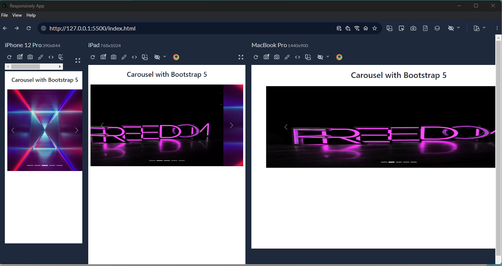

## ***CAROUSEL WITH BOOTSTRAP 5***

~~~
.carousel = it provides the CSS ruleset for the carousel layout
.carousel-indicators = adds the bar icons for the navigation 
.carousel-inner = contains the picturs for the carousel (as far as you go!)
~~~

 >button can be called by attribute also not only with >script so:
~~~

  <button type="button" data-bs-target="#indicadores" data-bs-slide-to="0" class="active"></button>
~~~
>   id="indicadores"
>   data-bs-target="#indicadores"
> MAKES THE CONNECTION BETWEEN SLIDE PICTURE AND THE ICON > BAR

~~~
<button type="button" class="carousel-control-prev" data-bs-target="#indicadores" data-bs-slide-to="prev">
  
</button>
<button type="button" class="carousel-control-next" data-bs-target="#indicadores" data-bs-slide-to="next">
  
</button> 
~~~
> class="carousel-control-prev or -next" adds CSS bootstrap defoult clases
~~~

~~~
> add left and right icon 
~~~
data-bs-target="#indicadores"  = matches id with where pics are contain to buttons

data-bs-slide-to="prev" or -to="next" =  bootstrap inner code for make pics slide with the prev and next icons
~~~